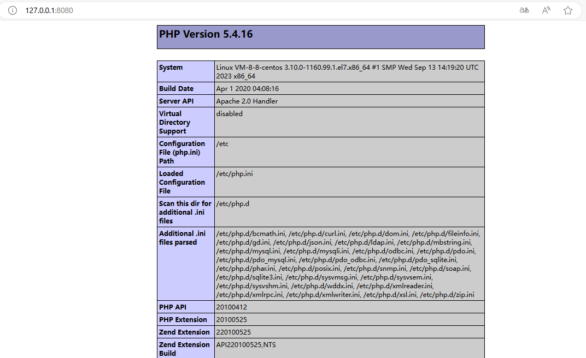
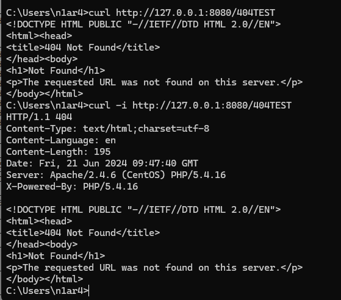
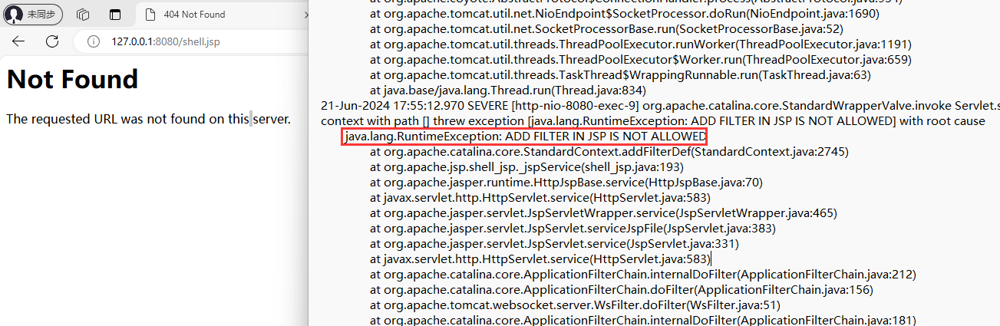
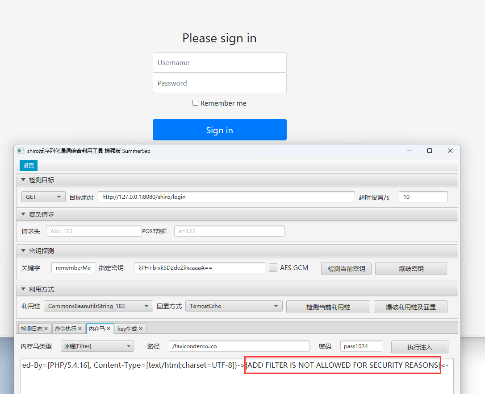

## Safe Tomcat

`Safe Tomcat` 项目是基于 `Apache Tomcat 8.5.100` 的分支

源码链接：https://github.com/apache/tomcat/releases/tag/8.5.100

开发目的：改写一个自用的、安全的、难以被漏洞利用的 `Apache Tomcat` 分支

注意：没有进行完善的测试，不保证生产可用，仅供安全研究和学习

混淆:

404页面特殊处理:

不允许内存马:

阻止反序列化打入内存马:

### 更新日志

#### 001 不允许在 `JSP` 中动态添加 `Filter`

- 原因：阻止通过 `JSP` 文件添加 `Filter` 类型内存马
- 实现：检查当前线程堆栈信息黑名单

#### 002 设置 `Dynamic.addFilter` 中的 `Filter` 类加载器黑名单

- 原因：阻止通过反序列化漏洞添加的 `Filter` 类型内存马
- 实现：通过 `filter.getClass().getClassLoader()` 检查

#### 003 检查 `StandardContext.addChild` 堆栈信息

- 原因：阻止通过 `JSP` 或反序列化漏洞添加的 `Servlet` 类型内存马
- 实现：黑名单方式拉黑例如 `TemplatesImpl` 等

### 004 检查 `addApplicationEventListener` 堆栈信息

- 原因：阻止通过 `JSP` 或反序列化漏洞添加的 `Listener` 类型内存马
- 实现：黑名单方式拉黑例如 `TemplatesImpl` 等

### 005 检查 `StandardPipeline.addValve` 堆栈信息

- 原因：阻止通过 `JSP` 或反序列化漏洞添加的 `Valve` 类型内存马
- 实现：黑名单方式拉黑例如 `TemplatesImpl` 等

### 006 检查 `AbstractEndpoint.setExcutor` 堆栈信息

- 原因：阻止通过 `JSP` 或反序列化漏洞添加的 `Excutor` 类型内存马
- 实现：黑名单方式拉黑例如 `TemplatesImpl` 等

### 007 检查 `httpUpgradeProtocols.get` 类加载器信息

- 原因：阻止动态添加的 `Upgrade` 内存马的利用
- 实现：检查 `UpgradeProtocol` 类加载器黑名单

### 008 不允许 `AccessLog` 设置恶意 `suffix`

- 原因：防止其他组件修改 `AccessLog` 为 `JSP/JSPX` 后缀
- 实现：限制 `set` 方法并定时循环检查是否合法

### 009 删除 `WEBAPPS` 不必要的内容

- 原因：简化
- 实现：修改 `build.xml` 文件

### 010 不允许动态 `Java Agent`

- 原因：拒绝普通的 `Java Agent` 类型内存马
- 实现：加入 `-XX:+DisableAttachMechanism` 参数

### 011 修改默认配置文件

- 原因：关闭不必要功能且防止被探测
- 实现：关闭 `8005` 修改响应头为 `PHP`

### 012 将 `Tomcat` 伪装成 `PHP`

- 原因：迷惑其他人
- 实现：修改首页和默认的 `404` 渲染代码