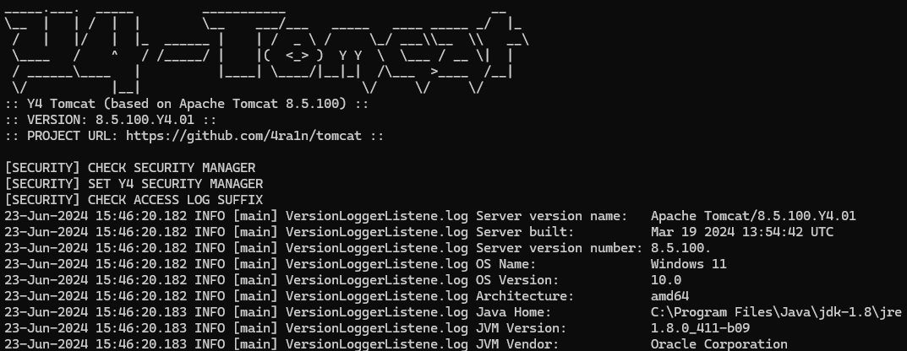
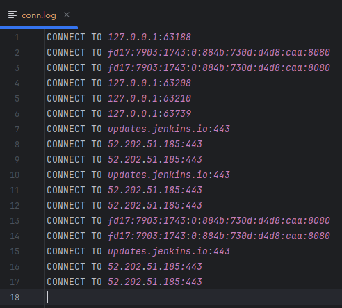
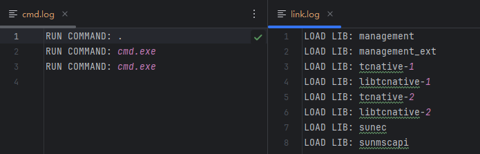
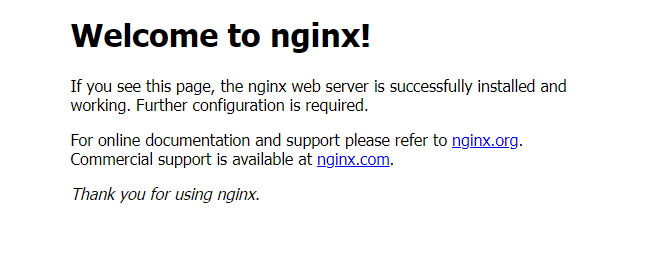
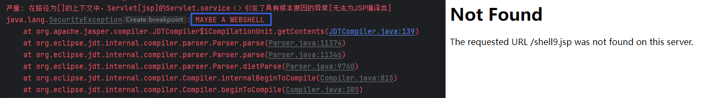

## Y4 Tomcat

`Y4 Tomcat` 项目是基于 `Apache Tomcat 8.5.100` 的分支

源码链接：https://github.com/apache/tomcat/releases/tag/8.5.100

开发目的：改写一个自用的、安全的、难以被漏洞利用的 `Apache Tomcat` 分支

主要新增功能如下，具体的功能以及实现请参考 `CHANGELOG.MD`

- 不允许通过 `JSP` 动态添加 `Filter/Servlet/Listener` 等内存马
- 不允许通过 `JSP` 执行命令（针对 `webshell` 脚本）
- 不允许通过 `JSP` 进行 `defineClass` 操作（针对高级 `webshell`）
- 不允许通过反序列化漏洞添加 `Filter/Servlet/Listener` 等内存马
- 定制 `SecurityManager` 禁止 `TemplatesImpl` 反序列化
- 不允许修改 `AccessLog` 的 `suffix` 为 `JSP/JSPX` 等恶意后缀
- 删除 `WEBAPPS` 中不必要的内容（仅保留一个首页）
- 禁止动态 `attach` 类型的 `Java Agent` 以阻止某些内存马
- 修改响应头和错误页面等配置内容将 `Tomcat` 模拟为一个 `Nginx` 服务
- 自定义 `SecurityManager` 记录各种可能存在风险的操作
- 删除 `BeanFactory` 防止 `JNDI` 漏洞利用的绕过

**注意：没有进行完善的测试，不保证生产可用，仅供安全研究和学习**

监控记录所有的 `CONNECT`

监控记录所有执行的命令和加载的本地库

首页

不允许内存马

阻止反序列化打入内存马

不允许常见的 `webshell`

### 更新日志

[CHANGELOG.MD](CHANGELOG.MD)